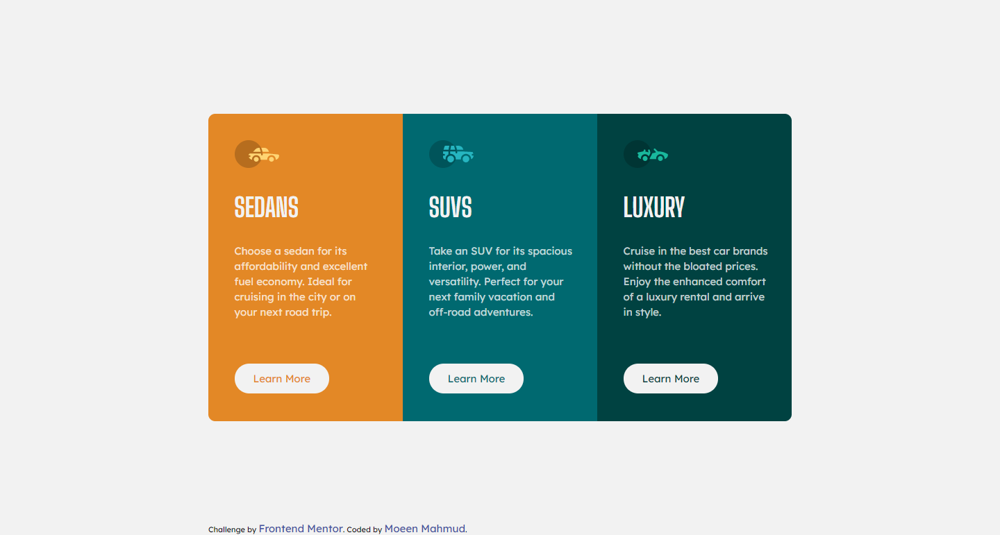

# Frontend Mentor - 3-column preview card component solution

This is a solution to the [3-column preview card component challenge on Frontend Mentor](https://www.frontendmentor.io/challenges/3column-preview-card-component-pH92eAR2-). Frontend Mentor challenges help you improve your coding skills by building realistic projects.

## Table of contents

- [Overview](#overview)
  - [The challenge](#the-challenge)
  - [Screenshot](#screenshot)
  - [Links](#links)
- [My process](#my-process)
  - [Built with](#built-with)
  - [What I learned](#what-i-learned)
  - [Continued development](#continued-development)
  - [Useful resources](#useful-resources)
- [Author](#author)

## Overview

### The challenge

Users should be able to view the optimal layout depending on their device's screen size

### Screenshot



### Links

- Solution URL: [GitRepo](https://github.com/moeen-mahmud/3-column-preview-card-component)
- Live Site URL: [LiveSite](https://moeen-3-column-preview-card-component.netlify.app/)

## My Process

### Built With

- HTML5 markup
- CSS custom properties
- Grid
- Mobile-first workflow
- [GoogleFonts](https://fonts.google.com/) - For font styles

### What I learned

By solving this project I learn how to use grid layout effectively and how they behave during css breakpoints. This project helps me to polish my web layout skill. This is the code where I implement the layouting and the second one is for media query.

```css
.container {
  display: grid;
  grid-template-columns: repeat(3, 1fr);
  place-items: center;
  height: 100vh;
  padding: 0 20rem;
}
```

```css
.container {
  display: grid;
  grid-template-columns: 1fr;
  padding: 4rem 2rem;
}
```

### Continued Development

I will countinue to build at least one project per day from [Frontendmentor.io](https://www.frontendmentor.io).

### Useful resources

- [Conquering Responsive Layouts](https://courses.kevinpowell.co/) - This is a great course from [Kevin Powell](https://twitter.com/KevinJPowell), I learned a lot how to layout a website with some interesting way!

- [MDN](https://developer.mozilla.org/en-US/) - My go to solution if I got stuck in some cases.

## Author

- Frontend Mentor - [fahim-mahmud](https://www.frontendmentor.io/profile/fahim-mahmud)
- Twitter - [moeen_mahmud](https://twitter.com/moeen_mahmud)
